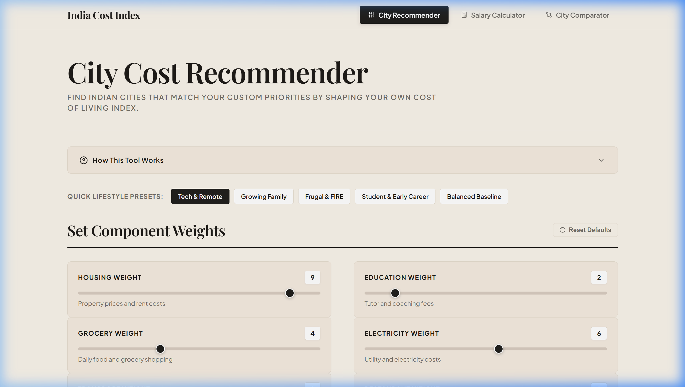
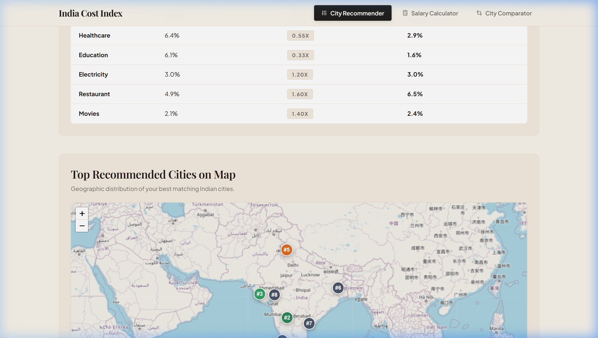
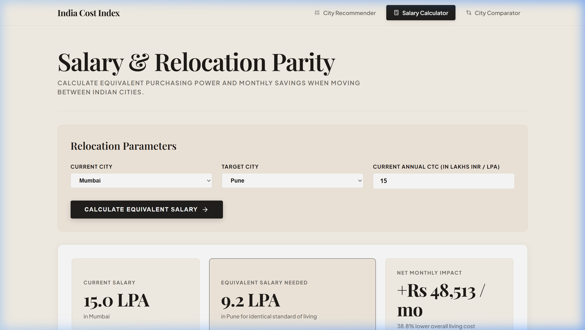
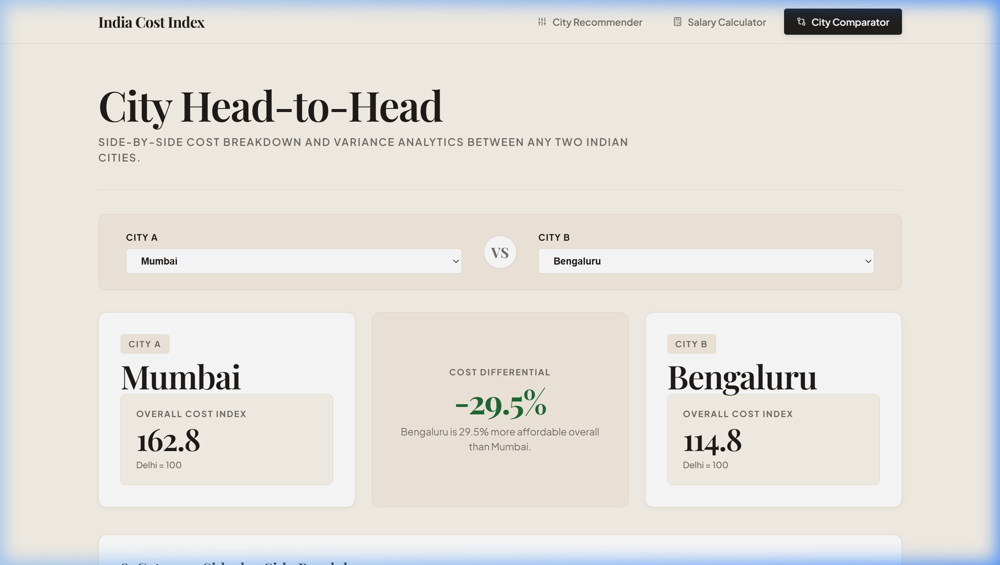

# India Cost of Living & City Intelligence Platform

**Live Deployment:** [https://india-cost-of-living-index.vercel.app](https://india-cost-of-living-index.vercel.app)  

An analytical platform and economic intelligence system evaluating cost of living metrics across 50 Indian cities using multi-source data (50,000+ data points), custom multi-attribute preference matching, purchasing power parity (PPP) salary calculators, and interactive geospatial mapping.

---

## Visual Overview

### 1. City Cost Recommender & Lifestyle Presets
Custom multi-criteria weighting engine with one-click lifestyle presets and interactive geographic mapping.



---

### 2. Interactive Geospatial Mapping
Leaflet.js mapping with OpenStreetMap tiles, custom rank pins, and responsive city detail overlays.



---

### 3. Salary & Relocation Parity Calculator
Calculates equivalent purchasing power and net monthly savings when relocating between any two Indian cities.



---

### 4. City Head-to-Head Comparator
Side-by-side comparative analysis with 8-dimension cost variance analytics.



---

## Core Capabilities

### 1. Personalized City Recommender
* **8 Expense Categories**: Housing, Grocery, Transport, Healthcare, Education, Electricity, Restaurant, and Movies.
* **1 to 10 Weight Multipliers**: Adjust priority scaling from 0.1x (unimportant) to 2.0x (critical priority).
* **Lifestyle Presets**: Instantly apply optimized weight profiles for Tech & Remote Workers, Growing Families, Frugal Savers (FIRE), and Students / Early Career professionals.
* **Instant Calculation**: Sub-5ms client-side index re-scoring across all 50 cities.

### 2. Purchasing Power Parity (PPP) Salary Calculator
* **Relocation Equivalence**: Computes the exact gross CTC required in a target city to maintain an identical standard of living.
* **Net Monthly Savings**: Displays estimated monthly budget differential (`+/- Rs / mo`).
* **Category Breakdown**: Granular variance percentages for each expense dimension between source and target cities.

### 3. Head-to-Head City Comparator
* **Comparative Cost Delta**: Displays percentage difference in overall living expenses between any two Indian cities.
* **Side-by-Side Breakdown**: Category-by-category index values with color-coded variance tags.

### 4. 50-City Database Explorer
* Searchable and sortable data table indexing all 50 cities benchmarked against Delhi (Delhi = 100).

---

## Mathematical Formulation

### 1. Component Weight Redistribution
Given baseline weights $w_i^{\text{base}}$ where $\sum w_i^{\text{base}} = 1.0$:

$$\text{multiplier}_i = \begin{cases} 0.1 + (s_i - 1) \times \frac{0.9}{4.0} & \text{if } s_i \le 5 \\ 1.0 + (s_i - 5) \times \frac{1.0}{5.0} & \text{if } s_i > 5 \end{cases}$$

$$\hat{w}_i = \frac{w_i^{\text{base}} \times \text{multiplier}_i}{\sum_{j} (w_j^{\text{base}} \times \text{multiplier}_j)}$$

### 2. Custom Cost Index
$$\text{Custom Index}_c = \sum_{i=1}^{8} I_{c, i} \times \hat{w}_i$$

*Where $I_{c, i}$ is the index of category $i$ in city $c$ relative to Delhi ($I_{\text{Delhi}, i} = 100$).*

### 3. Salary Equivalence (PPP)
$$\text{Salary}_{\text{target}} = \text{Salary}_{\text{current}} \times \left( \frac{\text{Index}_{\text{target}}}{\text{Index}_{\text{current}}} \right)$$

$$\text{Monthly Savings} = \frac{(\text{Salary}_{\text{current}} - \text{Salary}_{\text{target}}) \times 100,000}{12}$$

---

## Technology Stack

* **Frontend**: Vanilla HTML5, CSS3, Vanilla JavaScript (Zero framework overhead, 60fps responsiveness)
* **Geospatial Visualization**: Leaflet.js, OpenStreetMap
* **Typography**: Playfair Display, Plus Jakarta Sans
* **Icons**: Lucide SVG Icons
* **Data Layer**: Pre-compiled JSON Dataset (50 Cities, 8 Categories, Geographic Coordinates)
* **Deployment**: Vercel (Edge CDN, Zero Cold Starts)
* **Backend Analytics (Optional Service)**: Python 3.10+, FastAPI, Pandas, Scikit-Learn

---

## Project Structure

```
.
├── public/                     # Static web application (deployed to Vercel)
│   ├── css/
│   │   └── style.css           # Editorial typography & responsive styles
│   ├── data/
│   │   └── cities.json         # 50 Indian cities cost index dataset
│   ├── js/
│   │   ├── app.js              # Calculation engine, tabs, & Leaflet mapping
│   │   └── cities-data.js      # Synchronous dataset provider
│   └── index.html              # Main application entrypoint
├── docs/
│   └── images/                 # Platform screenshots
├── src/                        # Python analytics engine & ML models
│   ├── salary_calculator.py    # PPP salary conversion engine
│   ├── ml_personas.py          # K-Means archetype clustering
│   └── cache_engine.py         # Query cache layer
├── api/                        # FastAPI microservice
│   └── main.py                 # REST endpoints
├── vercel.json                 # Vercel deployment configuration
├── .vercelignore               # Vercel build exclusions
└── package.json                # Project metadata
```

---

## License

MIT License. Developed for research and city affordability benchmarking in India.
